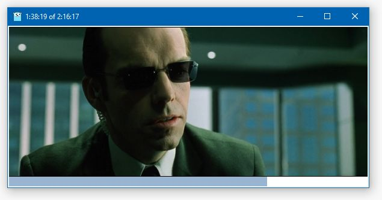

# Video playback

A native Windows video playback application written in pure Go with [Windigo](https://github.com/rodrigocfd/windigo). It uses DirectX with any codecs you have installed – no codecs are shipped.

This project demonstrates how to use [COM objects](https://docs.microsoft.com/en-us/windows/win32/com/component-object-model--com--portal) with Windigo, and it's largely experimental, so use with care.

CGo is **not** used.

## Keyboard shortcuts

| Shortcut | Description |
| -- | -- |
| Esc | Close application.
| Ctrl+O | Open video file (you can also drag a file into the window). |
| Space | Play or pause. |
| Left arrow | Go back 10 seconds. |
| Right arrow | Go forward 10 seconds. |

## Manifest

The `minimal.syso` file is a compiled [resource script](https://docs.microsoft.com/en-us/windows/win32/menurc/about-resource-files) with the application icon and a [manifest file](https://docs.microsoft.com/en-us/windows/win32/sbscs/application-manifests). It was copied directly from Windigo's `resources` directory.

## License

Licensed under [MIT license](https://opensource.org/licenses/MIT), see [LICENSE.md](LICENSE.md) for details.
